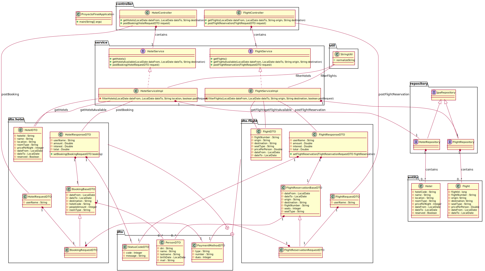

# XpertalDHBootcampProyectoFinal
En este proyecto se realiza la implementación de una REST API para una agencia de turismo, la cual brinda servicios de búsqueda y reserva de hoteles y vuelos.

## Requisitos

Dependencias de Maven añadidas a [pom.xml](./proyecto-final/pom.xml)
```xml
<dependency>
  <groupId>org.springframework.boot</groupId>
  <artifactId>spring-boot-starter-data-jpa</artifactId>
</dependency>
<dependency>
  <groupId>com.h2database</groupId>
  <artifactId>h2</artifactId>
</dependency>
```

Propiedades del proyecto [application.properties](./proyecto-final/src/main/resources/application.properties)
```
spring.jpa.hibernate.ddl-auto=none
logging.level.org.springframework.jdbc.datasource.init.ScriptUtils=debug
```

## API Endpoints
- GET /api/v1/hotels
- GET /api/v1/flights
- POST /api/v1/booking
- POST /api/v1/flight-reservation

[Especificación de requerimientos funcionales](https://docs.google.com/document/d/1jXuh3r7l-d9AI8skxWl5-TVglSMQGxKOF9ydHTM2YvE/edit)

[Postman Testing](./TestingUS.postman_collection.json)

## UML Class Diagrams
[](https://github.com/raulXprtl/XpertalDHBootcampProyectoFinal/blob/main/proyecto-final/uml/ClassDiagrams.svg)
